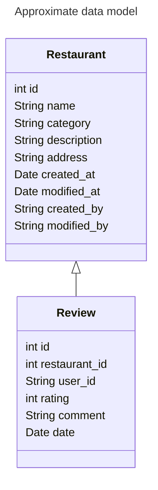

YALA: Yet Another Lunch App

## Getting Started

```bash
npm run dev
```

## E2E tests with Playwright

Playwright end to end tests are run on pull requests.

Check how install and run Playwright locally: https://playwright.dev/docs/intro


