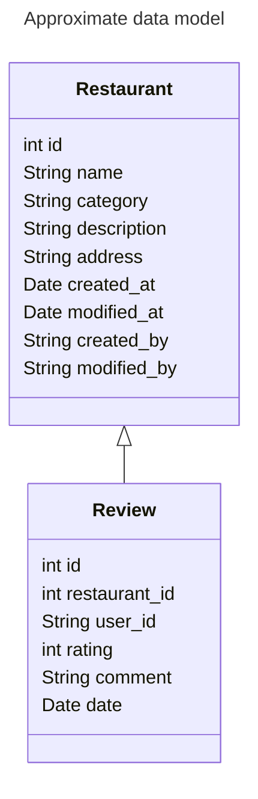

YALA: Yet Another Lunch App

## Getting Started

Prerequisites:

- [Node JS v22](https://nodejs.org/en)

You can install node using [nvm](https://github.com/nvm-sh/nvm) or for example with [homebrew](https://formulae.brew.sh/formula/node).

If you installed node with nvm, run `nvm use` before installing or running project.

After installing node, run `npm install` to install project dependencies.

Run project locally with `npm run dev`

## E2E tests with Playwright

Playwright end to end tests are run on pull requests.

Check how install and run Playwright locally: https://playwright.dev/docs/intro

