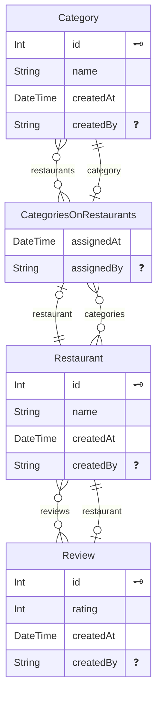

```mermaid
erDiagram

  "Category" {
    Int id "🗝️"
    String name 
    DateTime createdAt 
    String createdBy "❓"
    }
  

  "Restaurant" {
    Int id "🗝️"
    String name 
    DateTime createdAt 
    String createdBy "❓"
    }
  

  "Review" {
    Int id "🗝️"
    Int rating 
    DateTime createdAt 
    String createdBy "❓"
    }
  

  "CategoriesOnRestaurants" {
    DateTime assignedAt 
    String assignedBy "❓"
    }
  
    "Category" o{--}o "CategoriesOnRestaurants" : "restaurants"
    "Restaurant" o{--}o "CategoriesOnRestaurants" : "categories"
    "Restaurant" o{--}o "Review" : "reviews"
    "Review" o|--|| "Restaurant" : "restaurant"
    "CategoriesOnRestaurants" o|--|| "Category" : "category"
    "CategoriesOnRestaurants" o|--|| "Restaurant" : "restaurant"
```
