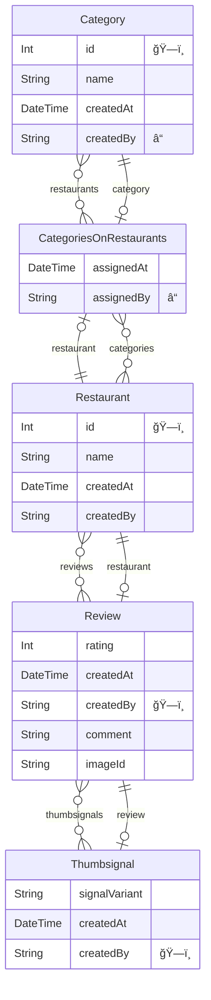

```mermaid
erDiagram

  "Category" {
    Int id "ğŸ—ï¸"
    String name 
    DateTime createdAt 
    String createdBy "â“"
    }
  

  "Restaurant" {
    Int id "ğŸ—ï¸"
    String name 
    DateTime createdAt 
    String createdBy 
    }
  

  "Review" {
    Int rating 
    DateTime createdAt 
    String createdBy "ğŸ—ï¸"
    String comment 
    String imageId 
    }
  

  "Thumbsignal" {
    String signalVariant 
    DateTime createdAt 
    String createdBy "ğŸ—ï¸"
    }
  

  "CategoriesOnRestaurants" {
    DateTime assignedAt 
    String assignedBy "â“"
    }
  
    "Category" o{--}o "CategoriesOnRestaurants" : "restaurants"
    "Restaurant" o{--}o "CategoriesOnRestaurants" : "categories"
    "Restaurant" o{--}o "Review" : "reviews"
    "Review" o|--|| "Restaurant" : "restaurant"
    "Review" o{--}o "Thumbsignal" : "thumbsignals"
    "Thumbsignal" o|--|| "Review" : "review"
    "CategoriesOnRestaurants" o|--|| "Category" : "category"
    "CategoriesOnRestaurants" o|--|| "Restaurant" : "restaurant"
```
